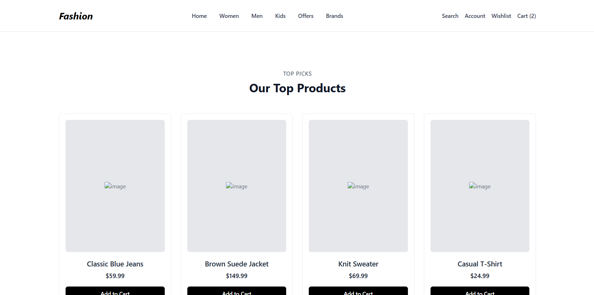
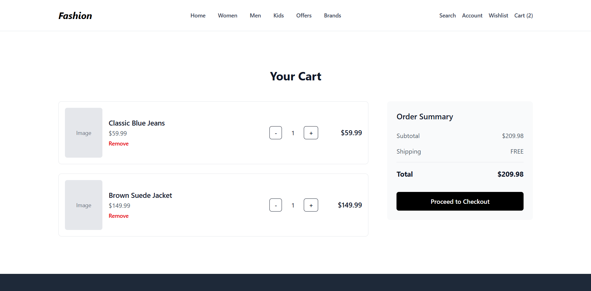
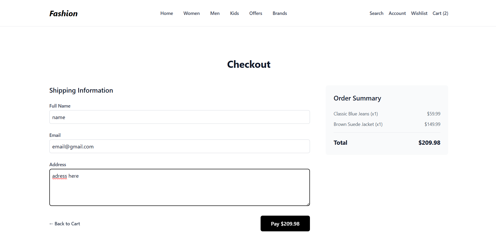
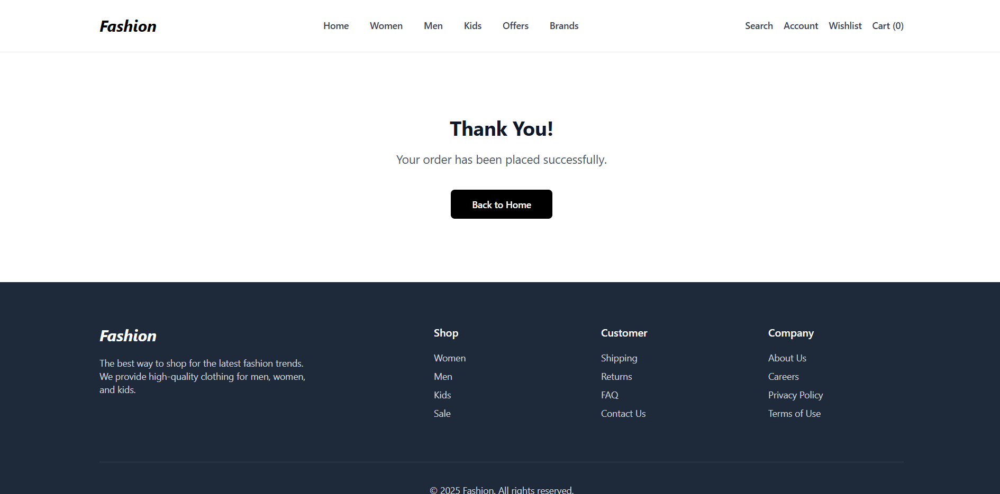

# Ecom-Fashion

A simple fullstack fashion e-commerce web application. Users can browse fashion items, add products to their cart, view cart totals, and finalize a purchase (demo, no real payments).

## Explain

Ecom-Fashion is a fullstack demo web application for exploring modern e-commerce workflows. Built with React, Node.js, Express, and MongoDB, it lets users browse fashion products, add items to their cart, view a running total in the cart page, and complete a simulated purchase (without processing real payments). The project demonstrates seamless frontend-backend integration for dynamic product listing and basic order management. With a clean, minimal interface, the platform focuses on essential cart and checkout operations—ideal for learning, prototyping, or expanding upon basic e-commerce functionality. Ecom-Fashion is open-source and easily customizable for further development.

## Features

- Browse fashion items
- Add items to cart
- View cart contents and total price
- Simple purchase workflow (transaction simulated)
- Built with:
  - **Frontend:** React
  - **Backend:** Node.js, Express
  - **Database:** MongoDB

## Screenshots

Example:

_Home page displaying fashion products._


_Cart page showing added items and total._


_Checkout page._


_Order confirmed._

## Getting Started

### Prerequisites

- Node.js & npm installed
- MongoDB running locally or remotely

### Installation

1. **Clone the repository:**

   ```sh
   git clone https://github.com/nilanshugarhewal/ecom-fashion.git
   cd ecom-fashion
   ```

2. **Install dependencies:**

   - For backend:
     ```sh
     cd backend
     npm install
     ```
   - For frontend:
     ```sh
     cd frontend
     npm install
     ```

3. **Configure environment variables:**

   - Set up your MongoDB connection string, and other required variables in a `.env` file, see `.env.example` or instructions in backend folder.

4. **Run the development servers:**

   - Backend:
     ```sh
     npm start
     ```
   - Frontend (in another terminal):
     ```sh
     npm start
     ```

5. Open [http://localhost:3000](http://localhost:3000) in your browser.

## Usage

- Browse products on the home/shop page.
- Click “Add to Cart” to save items in your session cart.
- Go to the “Cart” page to see selected items and the running total.
- Click “Purchase” to simulate checking out (no money is transferred; it’s demo only).

## License

This project is licensed under the MIT License.

## Acknowledgments

- Inspired by minimal e-commerce solutions
- Built with MERN stack
